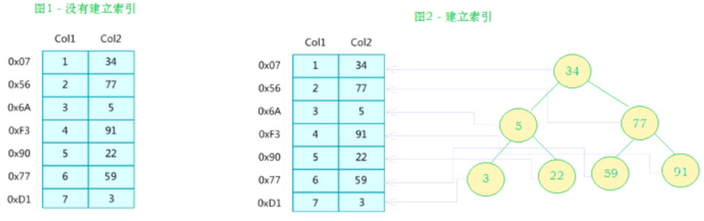

# MySQL高级-day01

### MySQL高级课程简介

| 序号 | day01              | day02       | day03          | day04         |
| ---- | ------------------ | ----------- | -------------- | ------------- |
| 1    | Linux系统安装MySQL | 体系结构    | 应用优化       | MySQL常用工具 |
| 2    | 索引               | 存储引擎    | 查询缓存优化   | MySQL日志     |
| 3    | 视图               | 优化SQL步骤 | 内存管理及优化 | MySQL主从复制 |
| 4    | 存储过程和函数     | 索引使用    | MySQL锁问题    | 综合案例      |
| 5    | 触发器             | SQL优化     | 常用SQL技巧    |               |


### 1. Linux系统安装MySQL

参考MySQL安装


### 2. 索引

#### 2.1 索引概述

MySQL官方对索引的定义未：索引（index）是帮助MySQL高效获取数据的数据结构（有序）。在数据之外，数据库系统还维护着满足特定查找算法的数据结构，这些数据结构以某种方式引用（指向）数据，这样久可以在这些数据结构上实现高级查找算法，这种数据结构就是索引。如下面的示意图所示：



左边是数据表，一共有两条七列数据，最左侧是记录数据的物理地址（注意逻辑上相邻的记录在磁盘上也并不一定是物理相邻）。为了加快col2的查找，可以维护一个右边所示的二叉查找树，每个节点分别包含索引键值和一个指向对应数据记录物理地址的指针，这样久可以运用二叉树快速查找到对应的数据。

一般来说索引本身也很大，不可能全部存储在内存中，因此索引往往以索引文件的型式存储在磁盘中。索引是数据库中用来提高性能的常用工具。


#### 2.2 索引的优势劣势

优势

1）类似于书籍的目录索引，提高数据检索的效率，降低数据库的IO成本。

2）通过索引列对数据进行排序，降低数据排序成本，降低CPU消耗。

劣势

1）实际上索引也是一张表，该表中保存了主键与索引字段，并指向实体类的记录，所以索引列也是要占用空间的。

2）虽然索引大大提高了查询效率，同时也降低更新表的速度，如对表进行INSERT、UPDAT、DELETE，因为更新表时，MySQL不仅要保存数据，还要保存一下索引文件，每次更新添加了索引列的字段，都会调整因为更新所带来的键值变化后的索引信息。


#### 2.3 索引结构

索引时在MySQL的存储引擎层中实现的，而不是在服务器层实现的，所以每种存储引擎的索引都不一定完全相同，也不是所有存储引擎都支持所有的索引类型。MySQL目前提供了以下四种引擎：

- BTREE索引：最常见的索引类型，大部分引擎都支持B树索引。
- HASH索引：只有Memory引擎支持，使用场景简单。
- R-tree索引（空间索引）：空间索引是MyISAM引擎的一个特殊索引类型，主要用于地理空间数据类型，通常使用较少。
- Full-text（全文索引）：全文索引也是MyISAM引擎的一个特殊索引类型，主要用于全文索引，InnoDB从MySQL5.6版本开始支持。


我们平常所说的索引，如果没有特别指明，都是指B+树索引（多路搜索树，并不一定是二叉的）结构组织的索引。其中聚集索引、复合索引、前缀索引、唯一索引默认都是使用B+tree索引，统称为索引。


##### 2.3.1 二叉树


二叉查找树, 每个节点分别包含索引键值和一个指向对应数据记录的物理地址的指针,这样就可以运用二叉查找在一定的复杂度内获取相应的数据,从而快速的检索出符合条件 的记录。

- 左子树的键值小于根的键值

- 右子树的键值大于根的键值

从二叉树的查找过程了来看，最坏的情况下磁盘IO的次数由树的高度来决定。从前面分析情况来看，减少磁盘IO的次数就必须要压缩树的高度，让瘦高的树尽量变成矮胖的树，所以引出B-Tree强势登场。


##### 2.3.1 BTREE结构

B-Tree又叫多路平衡搜索树，m阶B-Tree满足以下条件：

- 树中每个节点最多有m个孩子(m>=2)

- 除了根节点和叶子节点外，其它每个节点至少有Ceil(m/2)个孩子

- 若根节点不是叶子节点，则至少有两个孩子

- 所有叶子节点都在同一层

- 每个非叶子节点由n个key与n+1个指针组成，其中[ceil(m/2)-1]<=n<=m-1

以5叉BTree为例，key的数量：公式推导[ceil(m/2)-1]<=n<=m-1。所以2<=n<=4，当n>4时，中间节点分裂到父节点，两边节点分裂。

插入 C N G A H E K Q M F W L T Z D P R X Y S 数据为例。演变过程如下：

1）插入前4个字母 C N G A


2) 插入H，n>4，中间元素G字母向上分裂到新的节点


3）插入 E K Q 不需要分裂


4）插入 M ，中间元素M字母向上分裂到父节点G


5）插入 F、W、L、T，不需要分裂


6）插入 Z ，中间元素T向上分裂到父节点中


7）插入D，中间元素D向上分裂到父节点中，然后插入P、R、X、Y不需要分裂


8）最后插入S，NPQR节点n>5，中间节点Q向上分裂，但分裂后父节点DGMT的n>5，中间节点向上分裂


到此，该BTREE树久已经构件完成，BTREE和二叉树相比，查询数据的效率更高，因为对于相同的数据量来说，BTREE的层次结构比二叉树小，因此搜索速度快。

##### 2.3.2 B+TREE结构

B+TREE为BTREE的变种，B+TREE与BTREE的区别：

- n叉B+TREE最多含n个key，而BTREE最多含n+1个key

- B+TREE叶子节点保存所有key信息，，依key大小顺序排列

- 所有的非叶子节点都可以看作是key的所以部分


##### 2.3.3 MySQL中的B+TREE

MySQL索引数据结构对经典的B+TREE进行了优化，在原B+TREE的基础上，添加一个指向相邻叶子节点的链表指针，就形成了带有顺序指针的B+TREE，提高区间访问性能。


#### 2.4 索引分类

1）单值索引：一个索引只包含单个列,一个表可以有多个单值索引,一般来说, 一个表建立索引不要超过5个。

2）唯一索引：索引列的值必须唯一,但允许有空值

3）复合索引：一个索引包含多个列

4）全文索引：MySQL全文检索是利用查询关键字和查询列内容之间的相关度进行检索，可以利用全文索引来提高匹配的速度。


#### 2.5 索引语法

索引在创建表的时候，可以同时创建，也可以随时添加新的索引。

准备环境：

```sql
create database demo_01 default charset=utf8mb4;

use demo_01;

create table city(
 city_id int(11) not null auto_increment,
 city_name varchar(50) not null,
 country_id int(11) not null,
 primary key (city_id)
) engine=innodb default charset=utf8;

create table country(
 country_id int(11) not null auto_increment,
 country_name varchar(50) not null,
 primary key (country_id)
) engine=innodb default charset=utf8;


insert into city(city_id,city_name,country_id) values(1,'西安',1);
insert into city(city_id,city_name,country_id) values(2,'NewYork',2);
insert into city(city_id,city_name,country_id) values(3,'北京',1);
insert into city(city_id,city_name,country_id) values(4,'上海',1);

insert into country(country_id,country_name) values(1,'China');
insert into country(country_id,country_name) values(2,'America');
insert into country(country_id,country_name) values(3,'Japan');
insert into country(country_id,country_name) values(4,'UK');

```

##### 2.5.1 创建索引

语法	：

```sql
create [UNIQUE|primary|fulltext] index 索引名称 ON 表名(字段(长度))
```

示例：为city表中的city_name字段创建索引：

```sql
create index idx_city_name on city(city_name);
```


##### 2.5.2 查看索引

语法：

```sql
show index from table_name
```

示例，查看city表中的索引信息：


##### 2.5.3 删除索引

语法：

```sql
drop index index_name on tbl_name
```

示例：想要删除city表的idx_city_name索引，可以操作如下：


##### 2.5.4 ALTER命令

```
1). alter table tb_name add primary key(column_list);
    该语句添加一个主键，这意味着索引值必须是唯一的，且不能为NULL
    
2). alter table tb_name add unique index_name(column_list);
    这条语句创建索引的值必须是唯一的(除了NULL外，NULL的值可能会出现多次)
    
3). alter table tb_name add index index_name(column_list);
    添加普通索引，索引值可以出现多次
    
4). alter table tb_name add fulltext index_name(column_list);
    该语句指定了索引为fulltext，用于全文索引
```


#### 2.6 索引设计原则

索引设计可以遵循一些已有的原则，创建索引的时候请尽量考虑符合这些原则，便于提升索引的使用效率，更高效的使用效率。

- 对查询频次较高，且数据量比较大的表建立索引

- 索引字段的选择，最佳候选列应该中where子句的条件中提取，如果where子句中的组合比较多，那么应当挑选最常用的，过滤效果最好的列的组合。

- 使用唯一索引，区分度高，使用索引的效率越高

- 索引可以有效的提升查询数据的效率，但所有数量不是多多益善，所有越多，维护索引的代价自然也就水涨船高。对应插入、更新、删除等DML操作比较频繁的表来说，索引越多，会引入相当高的维护代价，降低DML操作的效率，增加相应操作的时间消耗。另外索引过多的话，MySQL也会犯选择困难病，虽然最终仍然会找到一个可用的索引，但无疑提高的选择的代价。

- 使用短索引，索引创建之后也是使用磁盘存储的，因此提升索引访问I/O效率，也可用提升总体的访问效率。假如构成索引字段的总长度比较短，那么在给定大小的存储块内可用存储更多的索引，相应的可用有效提升MySQL访问的I/O效率。

- 利用最左原则，N个列组合而成的组合索引，那么相当于创建了N个索引，如果查询的where子句中使用饿组成该索引的前几个字段，那么这条sql语句可用利用组合索引来提升查询效率。

```
创建复合索引：
create index idx_name_email_status on tb_seller(name,email,status);
就相当于
	对name创建索引
	对name，email创建了索引
	多name，email，status创建了索引
```


### 3. 视图

#### 3.1 视图的概述

​       视图（View）是一种虚拟存在的表，。视图并不在数据库中实际存在，行和列数据来自定义视图的查询中使用的表，并在使用视图时动态生成的。通俗的讲，视图就是一条SELECT语句执行后返回的结果集。所以我们在创建视图的时候，主要的工作落在创建这条SQL查询语句上。

视图相对普通的表优势主要包括以下几项：

- 简单：使用视图的用户完全不需要关心后面对应的表结构、关联条件和筛选条件，对用户来说已经是过滤好的复合条件的结果集。

- 安全：使用视图的用户只能访问他们被允许的结果集，对表的权限管理并不能限制到某个行某个列，但是通过视图就可以简单的实现。

- 数据独立：一旦视图的结构确定了，可以屏蔽表结构的变化对用户的影响，源表添加列对视图没有影响，源表修改列明，则可以修改视图来解决，不会造成对访问者的影响。

#### 3.2 创建或者修改视图

创建视图的语法为：

```sql
CREATE [OR REPLACE] [ALGORITHM = {UNDEFINED | MERGE | TEMPTABLE}]

VIEW view_name [(column_list)]

AS select_statement

[WITH [CASCADED | LOCAL] CHECK OPTION]
```

修改视图的语法为：

```sql
ALTER [ALGORITHM = {UNDEFINED | MERGE | TEMPTABLE}]

VIEW view_name [(column_list)]

AS select_statement

[WITH [CASCADED | LOCAL] CHECK OPTION]
```

选项：
    WITH [CASCADED | LOCAL] CHECK OPTION 决定了是否允许更新数据使记录不在满足视图的条件
	LOCAL：只要满足本视图的条件就可以更新
	CASCADED：必须满足所有针对该视图的所有视图的条件才可以更新

示例，创建city_country_view视图，执行如下SQL：

```sql
create or replace view city_country_view
as
select t.*,c.country_name from country c,city t where c.country_id=t.country_id;
```

查询视图：


#### 3.3 查看视图

​    从MySQL5.1版本开始，使用SHOW TABLES命令的时候不仅显示表的名字，同时也会显示视图的名字，而不存在单独显示视图的SHOW VIEW命令。


同样，在使用SHOW TABLE STATUS命令的时候，不但显示表的信息，也显示视图的信息。


如果要查询某个视图的定义，可以使用SHOW CREATE VIEW命令进行查看：


#### 3.4 删除视图

语法：

```sql
DROP VIEW [IF EXISTS] view_name [, view_name] ...[RESTRICT | CASCADE]
```

示例，删除视图city_country_view：

```sql
drop view city_country_view;
```


### 4. 存储过程和函数

#### 4.1 存储过程和函数概述

​        存储过程和函数是事先经过编译并存储再数据库中的一段SQL语句的集合，调用存储过程和函数可以简化应用开人员的很多工作，减少数据在数据库和应用服务器之间的传输，对于提高数据处理的效率是由好处的。

存储过程和函数的区别在于函数必须有返回值，而存储过程没有。

函数：是一个有返回值的过程；

过程：是一个没有返回值的函数；

#### 4.2 创建存储过程

```sql
CREATE PROCEDURE procedure_name ([proc_parameter[...]])
begin
    -- SQL 语句
end ;
```

示例：

```sql
delimiter $

create procedure pro_test1()
begin
    select 'hello mysql';
end$

delimiter ;
```

**<font color=red size=3>知识小贴士</font>**

DELIMITER

​        该关键字用来声明SQL语句的分隔符，告诉MySQL解释器，该段命令是否已经结束了，mysql是否可以执行了。默认情况下，delimiter是分号;。在命令行客户端中，如果有一条命令以分号结束，那么回车后，mysql将会执行这条命令。


#### 4.3 调用存储过程

```sql
call procedure_name();
```

#### 4.4 查看存储过程

```sql
-- 查看db_name数据库中的所有存储过程
select name from mysql.proc where db='db_name';

-- 查询存储过程的状态信息
show procedure status;

-- 查询某个存储过程的定义
show create procedure dbName.procedure_name;
```

#### 4.5 删除存储过程

```sql
DROP PROCEDURE [IF EXISTS] sp_name;
```

#### 4.6 语法

存储过程是可以编程的，意味着可以使用变量，表达式，控制结构，来完成比较复杂的功能。

##### 4.6.1 变量

- DECLARE

通过DECLARE可以定义一个局部变量，该变量的作用范围只能在BEGIN...END块中。

```sql
DECLARE var_name[,...] type [DEFAULT value]
```

示例：

```sql
delimiter $

create procedure pro_test2()
begin
  declare num int default 5;
  select num + 10;
end$

delimiter ;
```

- SET

直接赋值使用SET ，可以赋值常量或表达式，具体语法如下：

```sql
SET var_name = expr [,var_name = expr] ...
```

示例：

```sql
delimiter $

create procedure pro_test3()
begin
  declare name varchar(20);
  set name = 'mysql';
  select name;
end$

delimiter ;
```

也可以通过select ... into 方式进行赋值操作：

```sql
delimiter $

create procedure pro_test4()
begin
  declare countnum int;
  select count(*) into countnum from city;
  select countnum;
end$

delimiter ;
```

##### 4.6.2 if条件判断

语法结构：

```sql
if search_condition then statement_list

    [elseif search_condition then statement_list] ...
	
	[else statement_list]
	
end if;
```

需求：

```
根据定义的身高变量，判断当前身高的所属身材类型

      180 及以上 ----------->  身材高挑
	  170 - 180  ----------->  标准身材
	  170 以下   ----------->  一般身材
```

示例：

```sql
delimiter $

create procedure pro_test5()
begin
  declare height int default 175;
  declare description varchar(50) default '';
  if height >= 180 then 
    set description = '身材高挑';
  elseif height >= 170 and height < 180 then 
    set description = '标准身材';
  else 
    set description = '一般身材';
  end if;
  select description;
end$

delimiter ;
```

调用结果为：


##### 4.6.3 传递参数

语法格式：

```sql
create procedure procedure_name([in/out/inout] 参数名 参数类型)
...

IN : 该参数可以作为输入参数，也就是需要调用方传入值，默认
OUT: 该参数作为输出，也就是该参数可以作为返回值
INOUT：既可以作为输入参数，也可以作为输出参数
```

**IN - 输入**

需求

```
根据定义的身高变量，判断当前身高的所属身材类型
```

示例：

```sql
delimiter $

create procedure pro_test6(in height int)
begin
  declare description varchar(50) default '';
  if height >= 180 then 
    set description = '身材高挑';
  elseif height >= 170 and height < 180 then 
    set description = '标准身材';
  else 
    set description = '一般身材';
  end if;
  select description;
end$

delimiter ;
```

调用结果为：


**OUT - 输出**

需求：

```
根据定义的身高变量，判断当前身高的所属身材类型
```

示例：

```sql
delimiter $

create procedure pro_test7(in height int, out description varchar(50))
begin
  if height >= 180 then 
    set description = '身材高挑';
  elseif height >= 170 and height < 180 then 
    set description = '标准身材';
  else 
    set description = '一般身材';
  end if;
end$

delimiter ;
```

调用：

```sql
call pro_test7(167,@description);

select @description;
```


**<font color=red size=3>小知识</font>**

@description ：这种变量要在变量名称前面加上"@"符号，叫做用户会话变量，代表整个会话过程他都是有作用的，这个类似于全局变量一样。

@@global.sort_buffer_size ：这种变量前加上"@@"符号，叫做系统变量


##### 4.6.4 case结构

语法结构：

```sql
方式一 ：

CASE case_value

  WHEN when_value THEN statement_list
  
  [WHEN when_value THEN statement_list] ...
  
  [ELSE statement_list]
  
END CASE;


方式二 ：

CASE

  WHEN search_condition THEN statement_list
  
  [WHEN search_condition THEN statement_list] ...
  
  ELSE statement_list]
  
END CASE;
```

需求：

```
给定一个月份，然后计算出所在季度
```

示例：

```sql
delimiter $

create procedure pro_test8(mon int)
begin
  declare result varchar(10);
  case 
    when mon>=1 and mon<=3 then
	  set result='第一季度';
	when mon>=4 and mon<=6 then
	  set result='第二季度';
	when mon>=7 and mon<=9 then
	  set result='第三季度';
	else
	  set result='第四季度';
  end case;
  select result;
end$

delimiter ;
```


##### 4.6.5 while循环

语法结构：

```sql
while search_condition do

    statement_list
	
end while;
```

需求：

```
计算从1加到n的值
```

示例：

```sql
delimiter $

create procedure pro_test9(n int)
begin
  declare total int default 0;
  declare start int default 1;
  while start <= n do 
    set total = total + start;
	set start = start + 1;
  end while;
  select total;
end$

delimiter ;
```

##### 4.6.6 repeat结构

有条件的循环控制语句，当满足条件的时候退出循环。while是满足条件才执行，repeat是满足条件就退出循环。

语法结构：

```sql
REPEAT

  statement_list
  
  UNTIL search_condition
  
END REPEAT;
```

需求：

```
计算从1加到n的值
```

示例：

```sql
delimiter $

create procedure pro_test10(n int)
begin
  declare total int default 0;
  repeat
    set total = total + n;
	set n = n -1 ;
	until n=0
  end repeat;
  select total;
end$

delimiter ;
```

##### 4.6.7 loop语句

LOOP实现简单的循环，退出循环的条件需要其他的语句定义，通常可以使用LEAVE语句实现，具体语法如下：

```sql
[begin_label:] LOOP

  statement_list
  
END LOOP [end_label]
```

如果不在 statement_list 中增加退出循环的语句，那么 LOOP 语句可以实现简单的死循环。


##### 4.6.8 leave语句

用来从标注的流程构造中退出，通常和BEGIN ... END 或者循环一起使用。下面一个使用 LOOP 和 LEAVE 的简单例子，退出循环：

需求：

```
计算从1加到n的值
```

示例：

```
delimiter $

create procedure pro_test11(n int)
begin
  declare total int default 0;
  c:loop
    set total = total + n;
	set n = n -1 ;
	if n<=0 then
	  leave c;
	end if;
  end loop c;
  select total;
end$

delimiter ;
```

##### 4.6.9 游标/光标

游标是用来存储查询结果集的数据类型，再存储过程和函数中可以使用光标对结果集进行循环的处理。光标的使用包括光标的声明、OPEN、FETCH和CLOSE，其语法分别如下。

声明光标：

```sql
DECLARE cursor_name CURSOR FOR select_statement;
```

OPEN 光标：

```sql
OPEN cursor_name;
```

FETCH 光标：

```sql
FETCH cursor_name INTO var_name [,var_name] ...
```

CLOSE 光标：

```sql
CLOSE cursor_name;
```

示例：

初始化脚本：

```sql
create table emp(
  id int(11) not null auto_increment,
  name varchar(50) not null comment '姓名',
  age int(11) comment '年龄',
  salary int(11) comment '薪水',
  primary key(id)
)engine=innodb default charset=utf8;

insert into emp(id,name,age,salary) values(null,'金毛狮王',55,3800),(null,'白眉鹰王',60,4000),(null,'青翼蝠王',38,2800),(null,'紫衫龙王',42,1800);
```

```sql
-- 查询emp表中的数据，并逐行获取进行展示

delimiter $

create procedure pro_test12()
begin
  declare e_id int(11);
  declare e_name varchar(50);
  declare e_age int(11);
  declare e_salary int(11);
  declare emp_result cursor for select * from emp;
  open emp_result;
  
  fetch emp_result into e_id,e_name,e_age,e_salary;
  select concat('id=',e_id,', name=',e_name,', age=',e_age,', salary=',e_salary);
  
  fetch emp_result into e_id,e_name,e_age,e_salary;
  select concat('id=',e_id,', name=',e_name,', age=',e_age,', salary=',e_salary);
  
  fetch emp_result into e_id,e_name,e_age,e_salary;
  select concat('id=',e_id,', name=',e_name,', age=',e_age,', salary=',e_salary);
  
  fetch emp_result into e_id,e_name,e_age,e_salary;
  select concat('id=',e_id,', name=',e_name,', age=',e_age,', salary=',e_salary);
  
  fetch emp_result into e_id,e_name,e_age,e_salary;
  select concat('id=',e_id,', name=',e_name,', age=',e_age,', salary=',e_salary);
  
end$

delimiter ;
```

通过循环结构，获取游标中的数据：

```sql
delimiter $

create procedure pro_test13()
begin
  declare e_id int(11);
  declare e_name varchar(50);
  declare e_age int(11);
  declare e_salary int(11);
  declare has_data int default 1;
  
  declare emp_result cursor for select * from emp;
  declare exit handler for not found set has_data=0;
  
  open emp_result;
  
  repeat
    fetch emp_result into e_id,e_name,e_age,e_salary;
    select concat('id=',e_id,', name=',e_name,', age=',e_age,', salary=',e_salary);
	until has_data=0
  end repeat;
  
end$

delimiter ;
```


#### 4.7 存储函数

语法结构：

```sql
CREATE FUNCTION function_name([param type ... ])
RETURNS type
BEGIN
   ...
END;
```

案例：

定义一个存储过程，请求满足条件的记录数;

```sql
delimiter $

create function count_city(countryId int)
returns int
begin
  declare cnum int ;
  select count(*) into cnum from city where country_id = countryId;
  
  return cnum;
end$

delimiter ;
```

调用：

```sql
select count_city(1);

select count_city(2);
```


### 5. 触发器

#### 5.1 介绍

触发器是与表有关的数据库对象，指在 insert/update/delete 之前或之后，触发并执行触发器中定义的SQL语句集合。触发器的这种特性可以协助应用在数据库端确保数据的完整性，日志记录，数据校验等操作。

使用别名OLD和NEW来引用触发器中发生变化的记录内容，这与其他的数据库是相似的。现在触发器还只支持行级触发，不支持语句级触发。

​		**触发器类型**													**NEW和OLD的使用**

​		INSERT型触发器										   NEW表示将要或者已经新增的数据

​		UPDATE型触发器										  OLD表示修改之前的数据,NEW表示将要或者已经修改后的数据

​		DELETE型触发器										   OLD表示将要或者已经删除的数据


#### 5.2 创建触发器

语法结构:

```sql
create trigger trigger_name

before/after insert/update/delete

on tbl_name

[ for each row] -- 行级触发器

begin

  trigger_stmt;

end;
```

示例需求

```
通过触发器记录 emp 表中的数据变更日志,包括增加,修改,删除
```

首先创建一张日志表:

```sql
create table emp_logs(
  id int(11) not null auto_increment,
  operation varchar(20) not null comment '操作类型，insert/update/delete',
  operate_time datetime not null comment '操作时间',
  operate_id int(11) not null comment '操作表的id',
  operate_params varchar(500) comment '操作参数',
  primary key(id)
)engine=innodb default charset=utf8;
```

创建insert型触发器,完成插入数据时的日志记录:

```sql
delimiter $

create trigger emp_insert_trigger
after insert
on emp
for each row
begin
  
  insert into emp_logs(id,operation,operate_time,operate_id,operate_params) values(null,'insert',now(),new.id,
  concat('插入后(id:',new.id,',name:',new.name,',age:',new.age,',salary:',new.salary,')'));

end$

delimiter ;
```

然后插入数据:

```sql
insert into emp(id,name,age,salary) values(null,'光明左使',30,3500);
```


创建update型触发器,完成修改数据时的日志记录:

```sql
delimiter $

create trigger emp_update_trigger
after update
on emp
for each row
begin
  
  insert into emp_logs(id,operation,operate_time,operate_id,operate_params) values(null,'update',now(),new.id,
  concat('修改前(id:',old.id,',name:',old.name,',age:',old.age,',salary:',old.salary,'),修改后(id:',new.id,',name:',new.name,',age:',new.age,',salary:',new.salary,')'));

end$

delimiter ;
```

然后修改数据:

```sql
update emp set salary=5000 where id=5;
```


创建delete型触发器,完成删除数据时的日志记录:

```sql
delimiter $

create trigger emp_delete_trigger
after delete
on emp
for each row
begin
  
  insert into emp_logs(id,operation,operate_time,operate_id,operate_params) values(null,'delete',now(),old.id,
  concat('删除前(id:',old.id,',name:',old.name,',age:',old.age,',salary:',old.salary,')'));

end$

delimiter ;
```

删除数据:

```sql
delete from emp where id=5;
```


#### 5.3 删除触发器

语法结构:

```sql
drop trigger [schema_name.]trigger_name
```

如果没有指定 schema_name ，默认为当前数据库。

#### 5.4 查看触发器

可以通过执行 SHOW TRIGGERS 命令查看触发器的状态、语法等信息。

语法结构:

```sql
show triggers;
```

